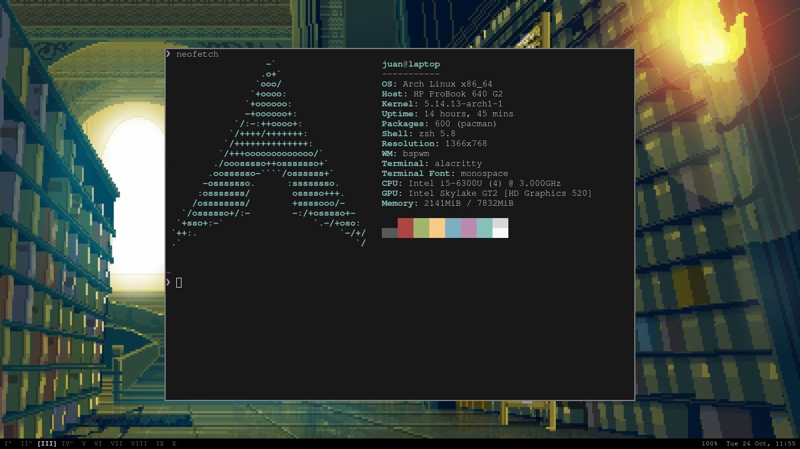

```
                   -`                    juan@arch
                  .o+`                   ---------
                 `ooo/                   OS: Arch Linux x86_64
                `+oooo:                  Host: B550M AORUS PRO-P
               `+oooooo:                 Kernel: 5.15.2-zen1-1-zen
               -+oooooo+:                Uptime: 15 hours, 4 mins
             `/:-:++oooo+:               Packages: 836 (pacman)
            `/++++/+++++++:              Shell: zsh 5.8
           `/++++++++++++++:             Resolution: 1920x1080
          `/+++ooooooooooooo/`           WM: bspwm
         ./ooosssso++osssssso+`          Tlheme: Adwaita [GTK2]
        .oossssso-````/ossssss+`         Icons: Adwaita [GTK2]
       -osssssso.      :ssssssso.        Terminal: alacritty
      :osssssss/        osssso+++.       Terminal Font: monospace
     /ossssssss/        +ssssooo/-       CPU: AMD Ryzen 7 5700G with Radeon Gra
   `/ossssso+/:-        -:/+osssso+-     GPU: AMD ATI 05:00.0 Cezanne
  `+sso+:-`                 `.-/+oso:
 `++:.                           `-/+/
 .`                                 `/
 ```
